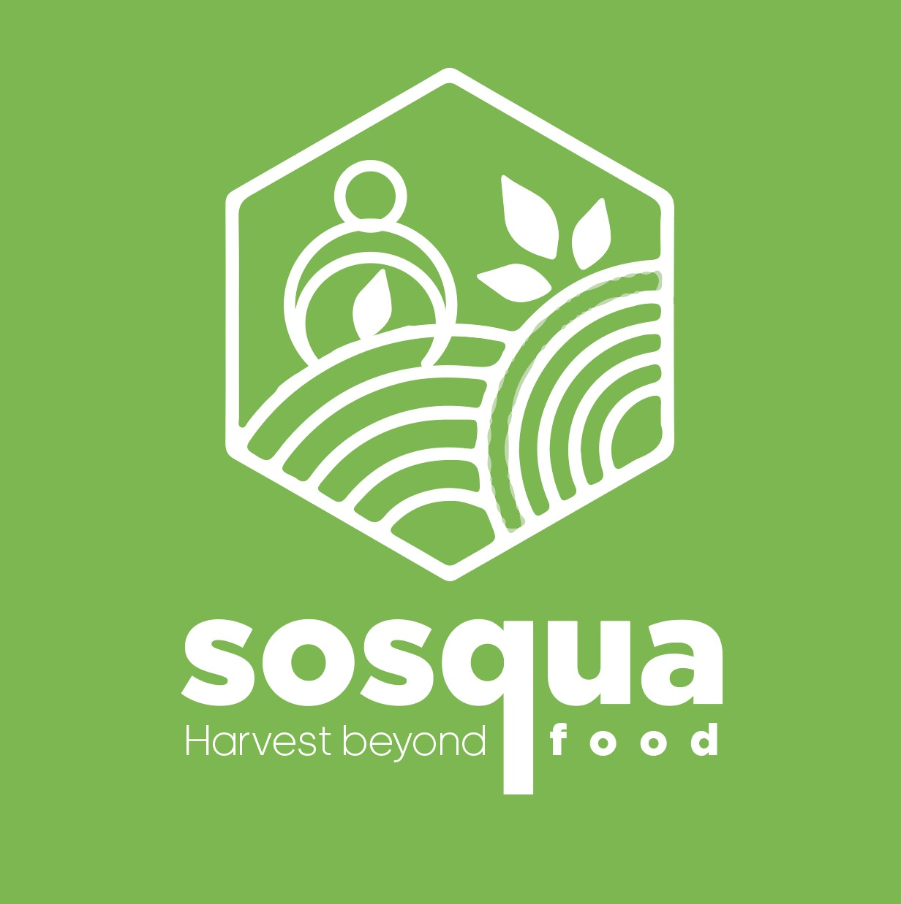
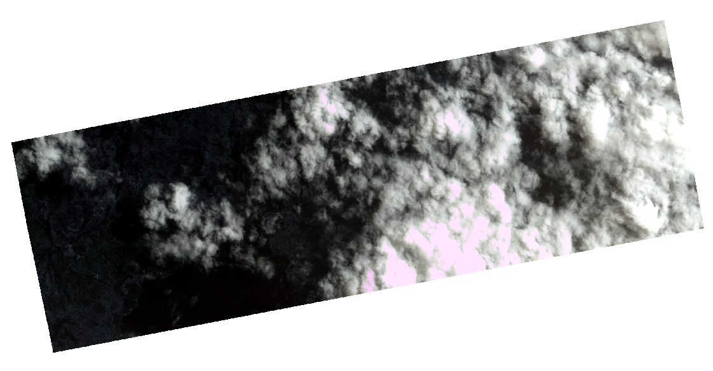
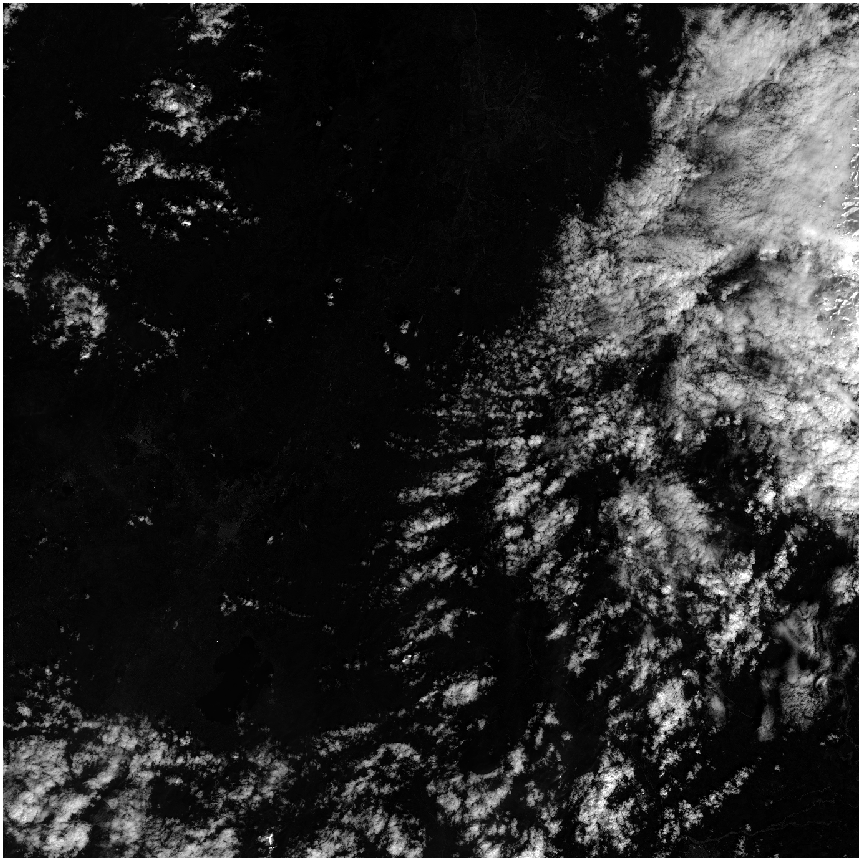
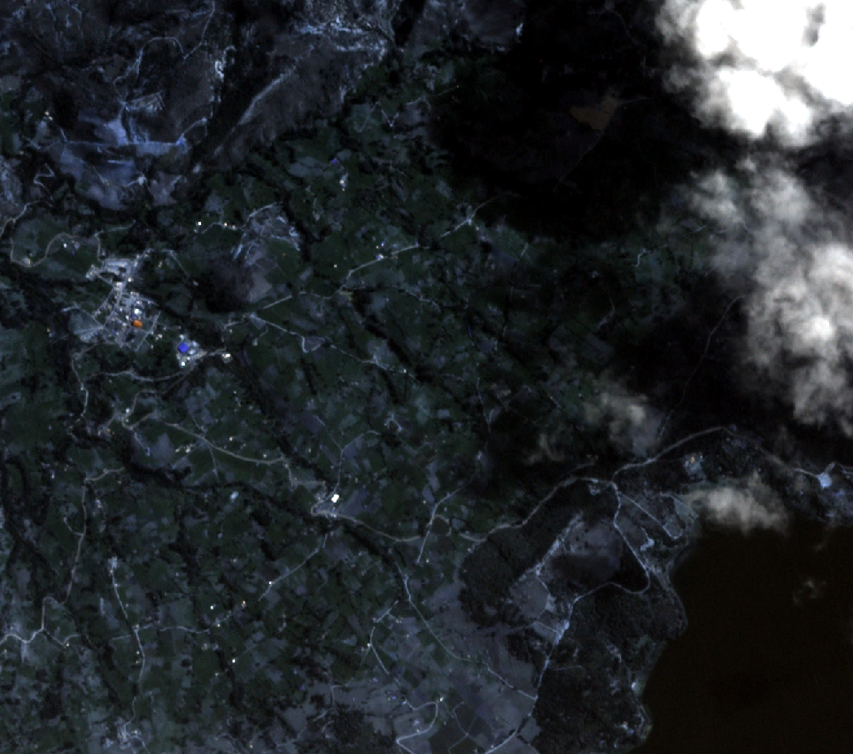
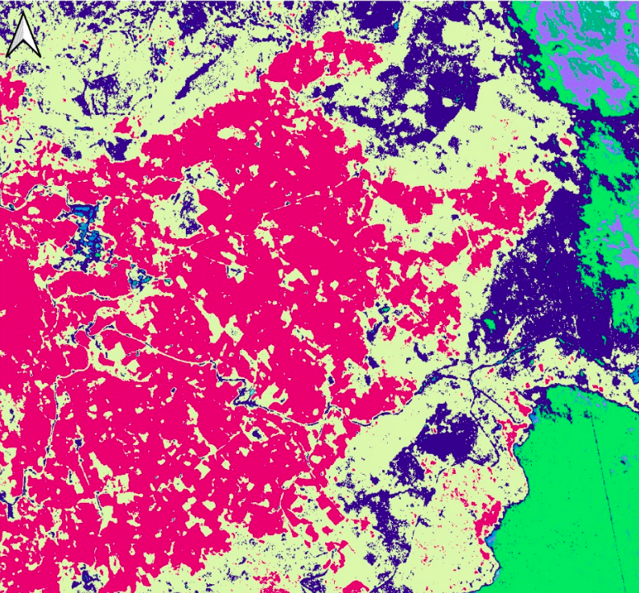
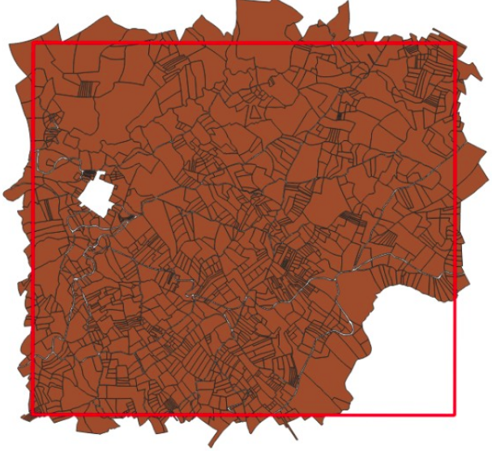
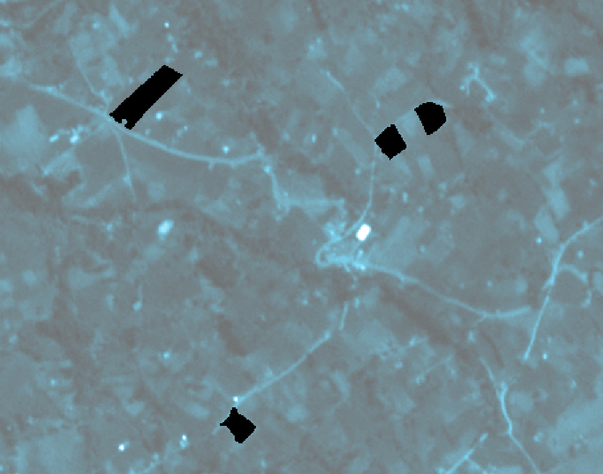

# SOSQUA
_**Harvest Beyond Food**_

 
 

SOSQUA is a community-supported agriculture web-app that links family farmers and local markets, based on actual food production and demand. Harvesting time per farm is estimated by monitoring growing crop cycles using optical satellite imagery-series and deriving greenness vegetation indices. Besides, a non-supervised classification is performed to identify croplands, which is validated by the farmers through the customized mobile application. This platform can be accessed by local markets to check for product availability and to contact suggested farmers, based on their location and harvesting time. Also, government institutes can access the portal to monitor harvesting dynamics and control prices.

## Table of Contents
<!--ts-->
   * [Description of the Problem](#description-of-the-problem)
   * [Solution Brief](#solution-brief)
   * [Pilot Test](#pilot-test)
      * [Choose a Place](#choose-a-place)
      * [Sentinel and Planet Imgery](#sentinel-and-planet-imagery)
      * [Pre-Processing](#pre-processing)
      * [Mask](#mask)
      * [Processing](#processing)
      * [Results](#results)
      * [WebApp](#webapp)
<!--te-->

## Description of the problem

Family farmers are core suppliers of food & nutrition. Around 60 million people work as smallholder family farmers in Latino America and the Caribbean, who produce 80% of the agriculture sector, which represents almost 40% of the sector GDP (FAO). Only in Colombia, there are 9.4 million of family farmers on the frontline keeping the food supply chain running during the COVID19 crisis. However, restrictions on movement and non-perishables preference are keeping 90% of these families from selling products. This has triggered price speculation and food losses in addition to the  9.76 million tons of food lost every year.

## Solution Brief

A way to support family farmers during and in the post-COVID crisis is by connecting them to local markets. Answering where, when and what products are going to be available and demanded in advance to starting up the supply chains. Monitoring crop status from the space by using vegetation indices allow us to track and account.

## Pilot Test

In order to contuct a concept study, a pilot test was developed for 4 farms for the last 6 months.

### Choose a Place

The criteria aspects in the selection of the place were:

- Existence of family farming: Based on official data from Rural Agricultural Planning Unit (UPRA) of Colombia: https://sipra.upra.gov.co/
- Kind of corps: Corps with more visual changes were prefered.
- Availability of datasets for the place (Area coverage > 90%, Cloud cover < 45%)
- Closeness to cities: Closer places were preferred due to transport facilities

Given these criteria facts, it was selected a zone on the edge of the Lake Tota (Laguna de Tota) which include the municipality of Cuitiva. This zone is framed within the following corners:

-72.9711983508027373,5.5625967687025044 : -72.9368196774082804,5.5930036243900689

### Sentinel and Planet Imagery

Both Sentinel 2A and PlanetScope Ortho Tiles imagery were used in the pilot test.

  
PlanetScope Imagery - 26/May/2020

  
Sentinel 2A Imagery Band 2 - 17/Dec/2019

A total of 23 datasets were downloaded.

### Pre-Processing

Each dataset was clipped using as extent the rectangle mentioned before:

-72.9711983508027373,5.5625967687025044 : -72.9368196774082804,5.5930036243900689

  

This operation was done using QGIS.

  
PlanetScope Imagery - 26/May/2020 - Clip

### Mask

In order to consolidate EVI averages per for the farm areas, it is necessary to create a layer specifying the farm areas. As it was mentioned before, this is a test developed for 4 farms. 
The mask was developed using the result of a supervised classification in QGIS (using the Semi-Automatic-Classification Plug-in of QGIS), a predial bounds shapefile of the zone and, finally, a shapefile of the layer "Likely for Family Agriculture"  from https://sipra.upra.gov.co/. 

  
Classifcation using Semi-Automatic-Classification plug-in- QGIS

  
Predial Shape file

Four farms were chosen manually. Finally was obtained a raster which contains the 4 areas. This raster can be found in Sosqua/RemoteSensing/Mask/Mask.tif

  
Mask over the map

### Processing

A python3 code was developed to process all the datasets. This code could be found it in Sosqua/RemoteSensing/Processing(Python)/MainCodeV1.py.
The code is based in a loop In each operation is opened a dataset, calculated the EVI, Saved the EVI in a raster and finally used the Mask.tif to obtain the average of the EVI values per zone. 

  
MainCodeV1.py Flowchart

### Results

The output of the MainCodeV1.py is located in: 

  
MainCodeV1.py Flowchart

### WebApp

It was designed and developed a base for the WebApp. It could be found here: https://github.com/oanlopezc/Sosqua/tree/master/maincode.sosqua

