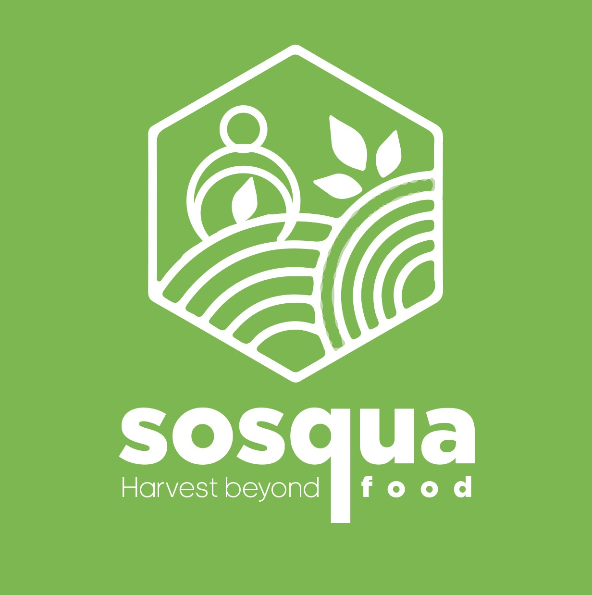
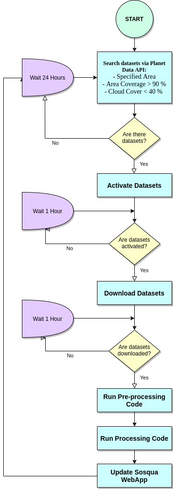

# SOSQUA
_**Harvest Beyond Food**_

  

## Description of the problem

Family farmers are core suppliers of food & nutrition. Around 60 million people work as smallholder family farmers in Latino America and the Caribbean, who produce 80% of the agriculture sector, which represents almost 40% of the sector GDP (FAO). Only in Colombia, there are 9.4 million of family farmers on the frontline keeping the food supply chain running during the COVID19 crisis. However, restrictions on movement and non-perishables preference are keeping 90% of these families from selling products. This has triggered price speculation and food losses in addition to the  9.76 million tons of food lost every year.

## Solution

A way to support family farmers during and in the post-COVID crisis is by connecting them to local markets. Answering where, when and what products are going to be available and demanded in advance to starting up the supply chains. Monitoring crop status from the space by using vegetation indices allow us to track and account.

## How?

### Getting the data
The Sentinel and Planet data sets will be used as the source for data analysis. Images will be automatically sought, activated, and downloaded using either Planet Data API for Planet and Sentinel data or Aria2 only for Sentinel. As an example of this proccess a flowchart is shown below.

### Pre-Processing and Processing

### WebApp
